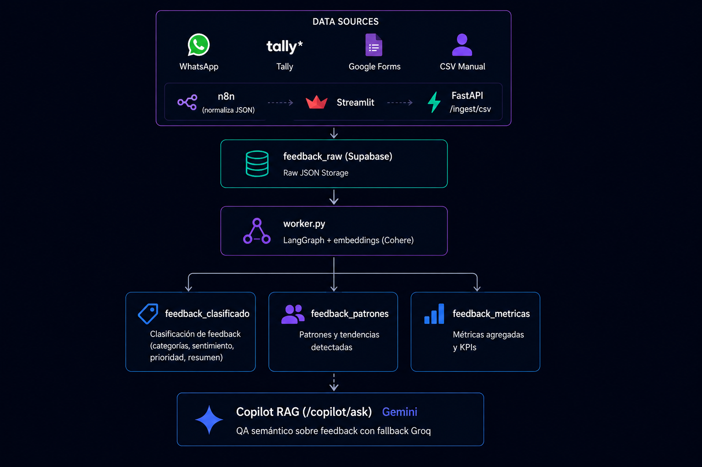

<p align="center">
  
</p>

<p align="center">
  <a href="docs/README.md">
    
  </a>
  <a href="docs/adr/README.md">
    
  </a>
  <a href="docs/estado-implementacion.md">
    
  </a>
</p>


# Feedback Classifier

Sistema de análisis automático de feedback: clasifica por **sentimiento, categorías y urgencia**, detecta **patrones**, resume mensajes y muestra **insights** en un panel Streamlit. Fuentes: WhatsApp, formularios web y encuestas (n8n) + carga manual.

**Documentación:** [docs/](docs/README.md) · **Estado:** [implementación](docs/estado-implementacion.md) · **Demo:** [checklist E2E](docs/guides/demo-e2e-clasificador.md) · **Propuesta expansión:** [más fuentes](docs/plans/futuro-ai-native.md)

## Arquitectura

<p align="center">
  
</p>


## Requisitos

| Requisito            | Descripción                                                                                                                          | Obligatorio |
| -------------------- | ------------------------------------------------------------------------------------------------------------------------------------ | :---------: |
| **Python 3.12+**     | Lenguaje principal para el backend (FastAPI, LangGraph y procesamiento de IA).                                                       |      ✅      |
| **Docker**           | Necesario para ejecutar **n8n** y los servicios de la aplicación en contenedores, simplificando el despliegue.                       |      ✅      |
| **Oracle Cloud**     | Infraestructura cloud para alojar el backend, contenedores, automatizaciones y servicios del sistema con alta disponibilidad.        |      ✅      |
| **Streamlit**        | Framework para desarrollar la interfaz web interactiva utilizada por los usuarios para consultar el sistema y visualizar resultados. |      ✅      |
| **FastAPI**          | Framework para la construcción de la API REST que conecta la interfaz, los agentes y los servicios externos.                         |      ✅      |
| **LangGraph**        | Framework para la orquestación de agentes de IA, definición de flujos conversacionales y coordinación de herramientas y modelos.     |      ✅      |
| **n8n**              | Plataforma de automatización de workflows para integrar servicios externos, ejecutar procesos programados y orquestar tareas.        |      ✅      |
| **Supabase Account** | Base de datos PostgreSQL con Row Level Security (RLS), autenticación y almacenamiento del feedback de los usuarios.                  |      ✅      |
| **Gemini API**       | Modelo principal para la clasificación de feedback, generación de respuestas y razonamiento del sistema.                             |      ✅      |
| **Cohere API**       | Servicio para la generación de embeddings utilizados en búsqueda semántica y arquitecturas RAG.                                      |      ✅      |
| **Groq API**         | Fallback opcional para la inferencia cuando Gemini responde con errores **503** o **429**, mejorando la disponibilidad del servicio. | ⚠️ Opcional |

## Configuración

```bash
cp .env.example .env
# Completar SOLO en .env local (nunca commitear — ver docs/guides/seguridad-y-secretos.md)
pip install -r requirements.txt
```

Variables en `.env` (plantilla en [`.env.example`](.env.example)):

| Variable | Uso |
|----------|-----|
| `DB_DSN` | FastAPI + worker (Session pooler Supabase) |
| `GEMINI_API_KEY` | Clasificador, patrones, Copilot |
| `COHERE_API_KEY` | Embeddings RAG |
| `API_KEY` | Header `X-API-Key` — generar con `openssl rand -hex 32` |
| `GROQ_API_KEY` | Fallback LLM (opcional, recomendado) |
| `SUPABASE_URL` / `SUPABASE_KEY` | Dashboard |
| `FASTAPI_INGEST_URL` | n8n Docker → `http://host.docker.internal:8000/ingest` |
| `FASTAPI_URL` | Dashboard/Copilot → `http://localhost:8000` |
| `WEBHOOK_URL` | Base HTTPS pública para Meta/WhatsApp (ngrok en local) |

### Optimización LLM (worker)

| Variable | Default | Descripción |
|----------|---------|-------------|
| `CONFIDENCE_REVIEW_THRESHOLD` | 0.7 | Marca mensajes para revisión humana |
| `CLASSIFY_LLM_BATCH_SIZE` | 8 | Mensajes por llamada (`1` = 1-a-1) |
| `CLASSIFY_MAX_TEXT_CHARS` | 300 | Textos largos van solos |
| `GEMINI_CONCURRENCY` | 3 | Chunks en paralelo |
| `GEMINI_CACHE_ENABLED` | true | Caché explícito Gemini (Fase B) |
| `GEMINI_CACHE_VERSION` | v3-taxonomia1 | Cambiar al editar prompts cacheados |
| `RECURRING_TOPICS_INTERVAL_DAYS` | 1 | Job temas recurrentes (0 = off) |
| `RECURRING_TOPICS_PERIOD_DAYS` | 7 | Ventana histórica de análisis |

Detalle: [docs/plans/optimizacion-llm.md](docs/plans/optimizacion-llm.md)

Aplicar schema en Supabase SQL Editor:

1. [`docs/database/supabase_schema.sql`](docs/database/supabase_schema.sql) (schema completo)
2. Si ya tenías tablas creadas, aplicar migraciones en orden: [006](docs/database/migrations/006_schema_hardening.sql) → [007](docs/database/migrations/007_production_hardening.sql) → [008](docs/database/migrations/008_acciones_y_revision.sql) → [009](docs/database/migrations/009_correcciones_humanas.sql) → [010](docs/database/migrations/010_motivo_revision.sql) → [011](docs/database/migrations/011_temas_recurrentes.sql)

## Levantar en local

### Terminal 1 — FastAPI (accesible desde n8n Docker)

```bash
cd backend
../.venv/bin/uvicorn src.api.main:app --reload --host 0.0.0.0 --port 8000
```

### Terminal 2 — Worker LangGraph

```bash
cd backend
../.venv/bin/python worker.py
```

### Terminal 3 — Dashboard

```bash
.venv/bin/streamlit run dashboard/main.py
```

### Terminal 4 — n8n (solo el contenedor, sin chocar con FastAPI local)

```bash
docker compose up -d --no-deps n8n
```

Abrir http://localhost:5679 → importar [`n8n/Feedback-Ingest-3-fuentes-a-FastAPI.json`](n8n/Feedback-Ingest-3-fuentes-a-FastAPI.json) → **activar workflow** (toggle ON) → reasignar credenciales Google/WhatsApp si hace falta.

Recrear n8n tras cambiar `.env`:

```bash
docker compose up -d n8n --no-deps --force-recreate
```

### Embeddings Copilot

El **worker** indexa embeddings automáticamente tras cada tick. Para backfill manual:

```bash
cd backend && ../.venv/bin/python scripts/backfill_embeddings.py
# o
cd backend && ../.venv/bin/python embed_job.py
```

## URLs locales

| Servicio | URL |
|----------|-----|
| FastAPI health | http://localhost:8000/health |
| FastAPI docs | http://localhost:8000/docs |
| Dashboard | http://localhost:8501 |
| n8n | http://localhost:5679 |

### Dashboard Streamlit (v3)

Navegación: **Vista General**, **Acciones sugeridas**, **Revisar clasificaciones**, Sentimiento, Urgencia, Mensajes Clasificados, Patrones, **Temas Recurrentes**, Exportar, Carga. Copilot IA en sidebar. Auto-refresh de cola cada 30 s.

Extensiones: [plan-clasificador-automejora.md](docs/plans/plan-clasificador-automejora.md)

## n8n — workflows y fuentes

| Archivo | Uso |
|---------|-----|
| [`n8n/Feedback-Ingest-3-fuentes-a-FastAPI.json`](n8n/Feedback-Ingest-3-fuentes-a-FastAPI.json) | Producción: WhatsApp Trigger, Tally webhook, Google Sheets (Forms) |
| [`n8n/feedback-ingest-simple.json`](n8n/feedback-ingest-simple.json) | Prueba con un solo webhook |

Tras importar y **activar** el workflow:

| Fuente | Cómo llega a n8n |
|--------|------------------|
| **WhatsApp** | Nodo **WhatsApp Trigger** — callback Meta = `{WEBHOOK_URL}/webhook/{webhookId}/webhook` (Production URL del nodo) |
| **Tally** | Webhook POST → `http://localhost:5679/webhook/tally` (o URL pública ngrok) |
| **Google Forms** | **Google Sheets Trigger** (~1 min) — formulario vinculado a Sheet; OAuth Google en n8n |

**Tally:** [`docs/guides/n8n-tally-webhook.md`](docs/guides/n8n-tally-webhook.md)

**Google Forms (alternativa sin OAuth):** [`docs/guides/n8n-google-forms-apps-script.md`](docs/guides/n8n-google-forms-apps-script.md)

**Nodo POST a FastAPI** (compartido por las 3 fuentes):

- URL: `http://host.docker.internal:8000/ingest` (o `={{ $env.FASTAPI_INGEST_URL }}`)
- Header: `X-API-Key: ={{ $env.API_KEY }}` (desde `.env`; preview rojo de `$env` en n8n es normal al editar)

WhatsApp requiere credencial **WhatsApp OAuth**; Google Sheets requiere **Google OAuth** en n8n.

Checklist completo: [`docs/guides/n8n-e2e-checklist.md`](docs/guides/n8n-e2e-checklist.md)

## Prueba E2E rápida

```bash
# 1. Ingest directo a FastAPI
curl -X POST http://localhost:8000/ingest \
  -H "Content-Type: application/json" \
  -H "X-API-Key: $API_KEY" \
  -d '{"external_id":"test-001","fuente":"manual","texto":"La app falla al pagar","timestamp":"2026-06-17T12:00:00Z","metadata":{}}'

# 2. Webhook Tally (workflow n8n activo)
curl -X POST http://localhost:5679/webhook/tally \
  -H "Content-Type: application/json" \
  -d '{"eventType":"FORM_RESPONSE","data":{"responseId":"tally-001","fields":[{"label":"Comentario","value":"Soporte muy lento"}]}}'
```

Verificar en Supabase y en el dashboard (**Mensajes Clasificados**):

```sql
SELECT external_id, fuente, estado FROM feedback_raw ORDER BY created_at DESC;
```

## Docker (stack completo)

```bash
docker compose up -d --build
```

Servicios: `api`, `worker`, `dashboard`, `n8n`. Para desarrollo local con FastAPI en el host, usar solo `docker compose up -d --no-deps n8n`.

Plantilla producción: [`.env.production.example`](.env.production.example)

## Documentación

Documentación completa en [`docs/`](docs/README.md). Punto de entrada según tu rol:

| Rol | Empezar por |
|-----|-------------|
| **Evaluador / revisor** | [Estado de implementación](docs/estado-implementacion.md) → [ADRs](docs/adr/README.md) |
| **Desarrollador** | [README](README.md) (instalación) → [Schema DB](docs/database/supabase_schema.sql) |
| **Operador (n8n)** | [Checklist E2E](docs/guides/n8n-e2e-checklist.md) |

### Decisiones de arquitectura (ADR)

El diseño del sistema está documentado en [Architecture Decision Records](docs/adr/README.md):

- LLM y clasificación (Gemini + Groq)
- Pipeline LangGraph (6 nodos)
- Ingestión n8n (WhatsApp, Tally, Google Forms)
- Supabase + RAG Copilot
- Dashboard Streamlit v3 + automejora acotada (ADR-009, ADR-010)

### Más recursos

- [Guías operativas](docs/guides/) — n8n, Tally, Forms, BI
- [Seguridad y secretos](docs/guides/seguridad-y-secretos.md) — qué no subir a Git
- [Base de datos](docs/database/) — schema y migraciones
- [Optimización LLM](docs/plans/optimizacion-llm.md) — fases A–D implementadas

## Formato CSV para carga manual

```csv
texto,fuente,external_id
"La app se cierra sola",csv,csv-001
"Muy buen servicio",csv,
```

| Columna | Obligatorio | Alias aceptados |
|---------|-------------|-----------------|
| `texto` | Sí | `content`, `message`, `comentario`, `text` |
| `fuente` | No (default `csv`) | `source` |
| `external_id` | No (UUID auto) | — |

También soporta **JSON** y **Excel** (`.xlsx`/`.xls`). En Excel se usa la **primera hoja con datos** que tenga columna `texto` o `content` (ignora hojas tipo LÉEME/readme).

Datasets de prueba locales: carpeta `Data/` (no versionada — ver `.gitignore`). Plantilla versionada: [`samples/plantilla_feedback.csv`](samples/plantilla_feedback.csv).

## Operaciones — reencolar errores

Si mensajes quedan en estado `error` (p. ej. rate limit 429 de Gemini/Groq):

```bash
cd backend && python scripts/requeue_errors.py
```

Si quedan atascados en `procesando` (worker crasheado):

```bash
cd backend && python scripts/recover_stuck_processing.py
```

Revisa los logs del worker tras reencolar. El dashboard muestra el conteo en la barra de estado y el banner de salud.

## Producción (single-tenant)

**¿Seguís en local?** No necesitás nada de esta sección — ver [docs/guides/entornos-dev-y-prod.md](docs/guides/entornos-dev-y-prod.md).

Plantilla: [`.env.production.example`](.env.production.example) · Plan: [docs/plans/plan-produccion-single-tenant.md](docs/plans/plan-produccion-single-tenant.md)

```bash
docker compose -f docker-compose.prod.yml --env-file /path/to/.env up -d
```

### Checklist go-live

1. Migraciones **007**, **008**, **009**, **010** y **011** aplicadas en Supabase prod
2. `API_KEY` rotada (`openssl rand -hex 32`) y `ENV=production`
3. Dashboard con rol `dashboard_readonly` + `DASHBOARD_READONLY=true`
4. Proxy TLS + Basic Auth delante del dashboard ([guía](docs/guides/dashboard-proxy-auth.md))
5. CI verde en `main` (ruff + pytest + gitleaks)
6. Worker + `recover_stuck_processing.py` probados con lote de 50 mensajes
7. n8n activo con `WEBHOOK_URL` HTTPS de producción
8. Backup Supabase verificado
9. Equipo conoce [runbook](docs/guides/runbook-produccion.md)

## Seguridad

- **No commitear** `.env` ni datasets locales (`Data/`).
- Plantillas: `.env.example`, `.env.production.example` (sin valores reales).
- Guía completa: [docs/guides/seguridad-y-secretos.md](docs/guides/seguridad-y-secretos.md)

## Tests

```bash
PYTHONPATH=backend:. .venv/bin/pytest tests/ -v
```

## Estructura del proyecto

```
backend/src/     # FastAPI, LangGraph, RAG
dashboard/       # Streamlit
shared/          # Constantes compartidas (ingesta CSV)
samples/         # Plantillas de ejemplo (sin datos reales)
n8n/             # Workflows exportados (sin API keys embebidas)
prompts/         # Prompts LLM (system, few-shot, patrones)
docs/            # Índice en docs/README.md
tests/           # Suite pytest (79+ tests)
.github/         # CI: ruff + pytest + gitleaks
docker-compose.prod.yml  # Despliegue producción
```
