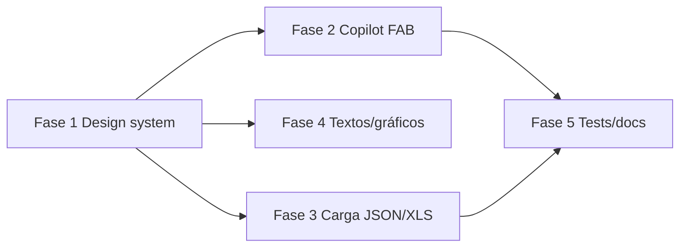

# Plan de implementación — Dashboard Streamlit v2

**Fecha:** junio 2026  
**Alcance:** carga multi-formato, Copilot flotante, design system visual  
**Dominio:** `dashboard/` (Frontend Agent) · opcional `backend/src/api/routes/ingest.py`

---

## Objetivos

1. **Ingesta manual ampliada:** CSV (ya existe) + JSON + XLS/XLSX → misma cola `feedback_raw` → worker LangGraph.
2. **Copilot global:** botón flotante visible en todas las secciones; chat desplegable sin cambiar de página.
3. **Design system:** paleta unificada, tipografía, iconografía coherente, assets locales (sin URLs rotas).

---

## Estado actual

| Área | Situación |
|------|-----------|
| Carga archivos | Solo CSV vía `POST /ingest/csv` |
| Copilot | Sección aislada en sidebar (`🤖 Copilot`) |
| Estilos | CSS mínimo en `main.py`; colores dispersos por componente |
| Logo sidebar | URL a `README.md` en GitHub → **no renderiza imagen** |
| Iconos | Emojis mezclados en nav, métricas y títulos (inconsistente) |

---

## Fase 1 — Design system (base visual)

**Duración estimada:** 1 sesión  
**Archivos nuevos**

```
dashboard/
  theme.py              # tokens: colores, radios, sombras, fuentes
  assets/
    logo.svg            # logo Feedback Classifier (local)
    favicon.png         # opcional
  styles/
    custom.css          # inyectado desde main.py vía st.markdown
```

### Paleta propuesta (modo claro CS-friendly)

| Token | Hex | Uso |
|-------|-----|-----|
| `--primary` | `#2563eb` | Acciones, links, FAB Copilot |
| `--primary-soft` | `#eff6ff` | Fondos activos sidebar |
| `--surface` | `#ffffff` | Cards |
| `--surface-muted` | `#f8fafc` | Fondo página / métricas |
| `--border` | `#e2e8f0` | Bordes cards |
| `--text` | `#0f172a` | Títulos |
| `--text-muted` | `#64748b` | Captions, labels |
| `--success` | `#16a34a` | Positivo / OK |
| `--danger` | `#dc2626` | Negativo / alertas |
| `--warning` | `#d97706` | Urgencia media |
| `--neutral` | `#94a3b8` | Neutral sentimiento |

Sentimiento y urgencia **reutilizan** estos tokens (no colores sueltos por archivo).

### Tipografía

- **Títulos:** `Inter` o `DM Sans` (Google Fonts en CSS).
- **Jerarquía:**
  - Página: `# Dashboard` → `st.title` + subtítulo `st.caption` muted
  - Sección: `st.header` sin emoji duplicado en nav
  - Métricas: label 0.82rem muted, value 1.75rem bold

### Iconografía

- **Nav sidebar:** prefijos Unicode minimalistas o SVG inline (📊 → icono único por sección, definido en `theme.NAV_ITEMS`).
- **Quitar emojis redundantes** en `st.subheader` cuando el nav ya los muestra.
- **Métricas:** iconos SVG 16px alineados al label (opcional fase 1.1).

### Componentes visuales reutilizables

```python
# dashboard/components/ui.py
def section_header(title, subtitle=None): ...
def metric_card(label, value, help_text=None): ...
def empty_state(message, icon="ℹ️"): ...
def badge(text, variant="neutral"): ...
```

Refactor progresivo: `metricas.py`, `patrones.py`, `urgencia.py` migran a `ui.py`.

### Fix inmediato sidebar

- Reemplazar `st.image(README.md URL)` por `dashboard/assets/logo.svg`.
- `st.set_page_config(page_icon="📊")` → favicon local.

**Criterio de aceptación Fase 1**

- [ ] Una sola fuente de verdad de colores (`theme.py`)
- [ ] Logo visible en sidebar
- [ ] Nav legible sin duplicar emoji en título de página
- [ ] Cards de patrones y métricas usan mismos tokens

---

## Fase 2 — Copilot flotante (todas las páginas)

**Duración estimada:** 0.5–1 sesión  
**Archivos**

| Archivo | Cambio |
|---------|--------|
| `dashboard/components/copilot.py` | Split: `render_chat()` + params `compact: bool` |
| `dashboard/components/copilot_fab.py` | **Nuevo** — FAB + popover/dialog |
| `dashboard/main.py` | Llamar `copilot_fab.render()` siempre al final |

### UX propuesta

```
┌─────────────────────────────────────┐
│  [Sidebar nav]    │  Contenido      │
│                   │                 │
│                   │            [🤖] │ ← FAB fixed bottom-right
└─────────────────────────────────────┘
         clic FAB → st.popover o st.dialog con chat
```

### Implementación Streamlit

**Opción A (recomendada):** `st.popover("Copilot", icon="🤖")` + CSS `position: fixed`.

**Opción B:** `st.dialog` + botón FAB que setea `st.session_state.copilot_open = True`.

### Estado de sesión

- `copilot_messages` — ya existe, se mantiene entre secciones.
- `copilot_since_days` — mover slider dentro del popover.
- Quitar ítem `🤖 Copilot` del radio nav (o dejarlo como alias que abre el popover).

**Criterio de aceptación Fase 2**

- [ ] Copilot accesible desde Vista General, Urgencia, Export, etc.
- [ ] Historial de chat persiste al cambiar sección
- [ ] FAB no tapa botones críticos en mobile (media query CSS)

---

## Fase 3 — Carga JSON + XLS/XLSX

**Duración estimada:** 1–1.5 sesiones  
**Enfoque:** parseo en Streamlit + endpoint existente (mínimo cambio backend).

### Flujo unificado

```
file_uploader (csv, json, xlsx)
    → preview (pandas)
    → validación columna/campo texto
    → POST /ingest/csv  (CSV sin cambios)
    → POST /ingest      (JSON/XLS fila a fila o batch)
    → feedback_raw pendiente
    → worker clasifica
```

### Formatos soportados

| Formato | Estructura esperada | Mapeo |
|---------|---------------------|-------|
| **CSV** | `texto`, `fuente?`, `external_id?` | Sin cambios |
| **JSON** | `[{"texto":"...", "fuente":"csv", "external_id":"..."}]` o objeto único | Normalizar a lista |
| **XLS/XLSX** | Primera hoja; columna `texto` obligatoria | `pd.read_excel()` |

### Archivos

| Archivo | Cambio |
|---------|--------|
| `dashboard/components/carga_csv.py` | Renombrar → `carga_archivos.py` |
| `dashboard/components/loaders.py` | **Nuevo** — `parse_csv`, `parse_json`, `parse_excel` |
| `dashboard/main.py` | Nav: `📁 Carga CSV` → `📁 Carga de datos` |
| `backend/.../ingest.py` | **Opcional Fase 3b:** `POST /ingest/batch` para una sola llamada |

### Dependencia Excel

```toml
# pyproject.toml o requirements dashboard
openpyxl>=3.1
```

### UX carga

1. Selector de tipo auto-detectado por extensión.
2. Preview 5 filas + contador total.
3. Botón **Enviar a cola** con spinner y resultado: `N encolados, M omitidos`.
4. Aviso: *"El agente procesará en el próximo ciclo del worker (~5 min)"*.

**Criterio de aceptación Fase 3**

- [ ] JSON array y JSON single object funcionan
- [ ] XLSX con columna `texto` funciona
- [ ] Filas sin texto se omiten (como CSV)
- [ ] Worker deja registros en `procesado`

---

## Fase 4 — Pulido y consistencia de textos

**Duración estimada:** 0.5 sesión

### Copy unificado (español, tono CS)

| Antes | Después |
|-------|---------|
| "Dashboard operativo de Customer Success" | "Monitoreo de feedback en tiempo casi real" |
| "Sin datos de clasificación aún." | "Aún no hay feedback clasificado. Cargá datos o esperá al worker." |
| Emojis en cada `st.subheader` | Título limpio + icono solo en nav |

### Gráficos Altair

- Aplicar `theme.py` colores en `sentimiento.py` (importar `COLOR_MAP` desde theme).
- Tooltip y leyendas con fuente Inter.

### Exportar

- Botones download con labels consistentes: *"Descargar CSV"*, *"Descargar JSON"*.

---

## Fase 5 — Tests y docs

| Tarea | Archivo |
|-------|---------|
| Test parsers JSON/XLS | `tests/unit/test_dashboard_loaders.py` |
| Test copilot session keys | smoke manual checklist |
| Actualizar README dashboard | sección UX + formatos carga |
| ADR-007 addendum | mencionar Copilot FAB + multi-upload |

---

## Orden de ejecución recomendado



**Prioridad negocio:** Fase 2 (Copilot) + Fase 3 (carga) en paralelo tras Fase 1 base.

---

## Riesgos y mitigaciones

| Riesgo | Mitigación |
|--------|------------|
| Streamlit no soporta FAB nativo | CSS fixed + popover/dialog |
| XLS archivos grandes | límite 5 MB en uploader; warning >500 filas |
| JSON mal formado | try/except + mensaje accionable |
| Worker apagado | banner global en sidebar si `pendiente` > 0 y worker offline (opcional Fase 4) |

---

## Checklist Human Gate (antes de merge)

- [ ] Solo archivos en `dashboard/` (+ tests + docs)
- [ ] Sin secrets en código
- [ ] FastAPI + worker probados con CSV, JSON, XLS
- [ ] Copilot FAB probado en 3 secciones distintas
- [ ] Logo/assets locales commiteados en `dashboard/assets/`

---

## Estimación total

| Fase | Esfuerzo |
|------|----------|
| 1 Design system | 3–4 h |
| 2 Copilot FAB | 2–3 h |
| 3 Carga JSON/XLS | 3–4 h |
| 4 Pulido textos | 1–2 h |
| 5 Tests/docs | 2 h |
| **Total** | **~12–15 h** |
