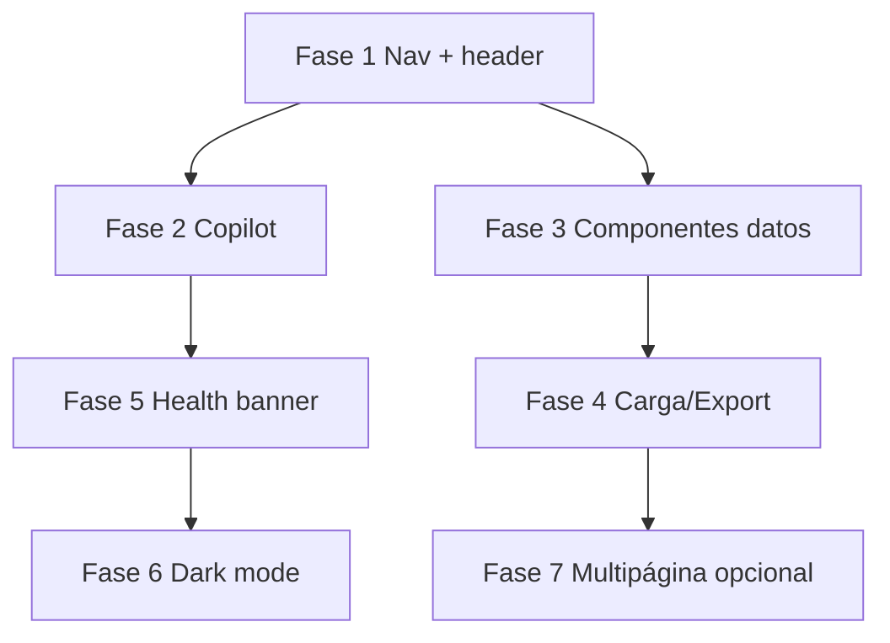

# Plan de implementación — UI/UX Dashboard v3

**Fecha:** junio 2026  
**Alcance:** mejorar experiencia visual, navegación, Copilot y feedback al usuario  
**Dominio:** `dashboard/` · sin cambios de backend salvo mensajes de estado opcionales

---

## Diagnóstico (estado post-v2)

### Lo que ya funciona

| Área | Estado |
|------|--------|
| Design tokens | `theme.py` + `custom.css` |
| Logo local | `assets/logo.svg` |
| Carga CSV/JSON/Excel | `carga_archivos.py` + `loaders.py` |
| Copilot modal | `st.dialog` + botones header/sidebar |
| Consulta RAG | Todo el histórico indexado por defecto |

### Problemas UX reportados

| Problema | Impacto |
|----------|---------|
| Copilot poco visible / confuso | Usuario no encuentra ni entiende cómo usarlo |
| Burbuja flotante con CSS frágil | Rompe layout, difícil de mantener |
| Nav con símbolos ◆ ◈ poco claros | No comunican función |
| Sin estados de carga consistentes | Pantallas vacías sin guía |
| Sin feedback de pipeline | Usuario no sabe si worker procesó |
| Tablas densas (urgencia) | Difícil escanear alertas |
| Copilot duplicado (header + sidebar) | Redundante si no se unifica criterio |

---

## Principios UX del producto

1. **Una acción principal por pantalla** — Copilot = asistente; dashboard = monitoreo.
2. **Visible sin explicación** — botones con verbo + contexto (`Abrir Copilot`, no solo icono).
3. **Progressive disclosure** — filtros avanzados ocultos hasta que el usuario los pida.
4. **Feedback inmediato** — spinners, toasts, banners de estado del worker.
5. **Streamlit-native first** — `dialog`, `popover`, `columns`; CSS solo para polish, no layout crítico.

---

## Fase 1 — Navegación y jerarquía visual (prioridad alta)

**Duración:** 3–4 h  
**Objetivo:** que el usuario se oriente en 5 segundos.

### 1.1 Sidebar rediseñado

| Cambio | Detalle |
|--------|---------|
| Iconos legibles | Reemplazar ◆ ◈ ▲ por labels + emoji consistente o SVG en `theme.NAV_ITEMS` |
| Item activo destacado | CSS: fondo `--primary-soft`, borde izquierdo `--primary` |
| Agrupación | Sección "Análisis" (General, Sentimiento, Urgencia, Patrones) + "Datos" (Export, Carga) |
| Copilot único | **Un solo** entry point en sidebar (quitar duplicado del header o viceversa — ver 1.2) |

**Archivos:** `theme.py`, `main.py`, `custom.css`

### 1.2 Header de página simplificado

```
┌─────────────────────────────────────────────────────┐
│ Vista General                    [Abrir Copilot]    │  ← opción A: solo header
│ Monitoreo de feedback...                            │
└─────────────────────────────────────────────────────┘

O

Sidebar: [Copilot — Asistente IA]  ← opción B: solo sidebar (recomendado)
Header: solo título + subtítulo, sin botón
```

**Recomendación:** Copilot **solo en sidebar** (CTA primary fijo) + banner sutil en Vista General la primera vez. Header limpio.

### 1.3 Breadcrumb / contexto

- Caption bajo título: `"Última actualización: hace X min"` (desde Supabase o cache timestamp).
- Indicador si hay N mensajes `pendiente` sin clasificar.

**Archivos:** `dashboard/components/status_bar.py` (nuevo), `supabase_queries.py`

---

## Fase 2 — Copilot UX profesional (prioridad alta)

**Duración:** 4–5 h  
**Objetivo:** experiencia tipo asistente embebido, no parche.

### 2.1 Layout del dialog

| Elemento | Diseño |
|----------|--------|
| Header | Barra azul fija: título + subtítulo + botón cerrar (X) |
| Cuerpo | Scroll solo en mensajes; input siempre visible abajo |
| Vacío | Ilustración + 3 chips de preguntas (ya parcialmente hecho) |
| Historial | Botón "Limpiar conversación" en footer |

### 2.2 Micro-interacciones

- Spinner con mensajes rotativos: *"Buscando feedback similar..."* → *"Generando respuesta..."*
- Fuentes citadas: cards compactas (no solo expander)
- Error accionable: *"FastAPI no responde → verificar puerto 8000"*

### 2.3 Filtros opcionales

- Mantener: todo indexado por defecto
- UI: link "Filtrar por fecha" → expande inline, no popover anidado
- Mostrar badge: `Todo el histórico` | `Últimos 30 días`

**Archivos:** `copilot.py`, `copilot_fab.py`, `custom.css`

### 2.4 Onboarding first-run

- `st.session_state.copilot_seen` → primera visita muestra `st.info` en Vista General: *"Usá Copilot en el menú lateral para preguntar sobre el feedback."*

---

## Fase 3 — Componentes de datos más legibles (prioridad media)

**Duración:** 4–6 h

### 3.1 KPI cards mejoradas (`metricas.py`)

- Delta vs lote anterior (↑ ↓)
- Color semántico: negativo en rojo suave, alertas en ámbar
- Skeleton loader mientras carga Supabase

### 3.2 Alertas de urgencia (`urgencia.py`)

- Filas con color de fondo según urgencia
- Columna "Acción sugerida" (texto fijo CS: *"Contactar en <24h"*)
- Badge fuente (WhatsApp / Forms / CSV)

### 3.3 Patrones (`patrones.py`)

- Cards con icono de impacto
- Ordenar por impacto × frecuencia
- Empty state con ilustración + CTA *"Cargar feedback de prueba"*

### 3.4 Gráficos (`sentimiento.py`)

- Altair theme desde `theme.py`
- Labels en español
- Tooltip enriquecido (% además de count)

**Archivos:** componentes existentes + `ui.py` (nuevos helpers: `metric_card`, `source_badge`, `skeleton`)

---

## Fase 4 — Carga de archivos y export (prioridad media)

**Duración:** 2–3 h

### 4.1 Upload wizard (`carga_archivos.py`)

```
Paso 1: Arrastrar archivo
Paso 2: Preview + validación (✓ 120 filas OK, ✗ 3 sin texto)
Paso 3: Confirmar → resultado con link a Supabase query
```

- Drag zone visual (borde dashed grande)
- Plantilla descargable CSV de ejemplo (`st.download_button`)

### 4.2 Export (`exportar.py`)

- Preview con filtros (fecha, fuente, sentimiento)
- Contador antes de descargar
- Nombre de archivo con timestamp

---

## Fase 5 — Sistema de feedback y estados (prioridad media)

**Duración:** 2–3 h

### 5.1 Banner global de salud

| Condición | Banner |
|-----------|--------|
| Worker OK + 0 pendientes | (ninguno) |
| N pendientes > 0 | Info: *"N mensajes en cola — el agente los procesará pronto"* |
| FastAPI caído | Warning en Copilot y Carga |
| Supabase error | Error con acción |

**Archivo:** `dashboard/components/health_banner.py`

### 5.2 Toasts / confirmaciones

- Tras carga exitosa: mensaje verde persistente 5s
- Tras export: *"Descarga lista"*

---

## Fase 6 — Modo oscuro y accesibilidad (prioridad baja)

**Duración:** 3–4 h

- Toggle en sidebar
- Tokens `--fc-*` en `[data-theme="dark"]`
- Contraste WCAG AA en textos y botones
- Focus visible en navegación por teclado

---

## Fase 7 — Multipágina Streamlit (opcional, largo plazo)

**Duración:** 6–8 h

Migrar de `radio` + `if/elif` a `dashboard/pages/`:

```
pages/
  1_Vista_General.py
  2_Sentimiento.py
  ...
```

**Beneficios:** URLs por sección, historial navegador, menos reruns pesados.

**Riesgo:** refactor grande; hacer solo si el equipo necesita URLs compartibles.

---

## Orden de ejecución recomendado



**Sprint 1 (impacto inmediato):** Fase 1 + Fase 2  
**Sprint 2 (pulido datos):** Fase 3 + Fase 5  
**Sprint 3 (nice-to-have):** Fase 4 + Fase 6 + Fase 7

---

## Matriz esfuerzo vs impacto

| Fase | Impacto UX | Esfuerzo | Prioridad |
|------|------------|----------|-----------|
| 1 Nav/header | Alto | Medio | P0 |
| 2 Copilot | Alto | Medio | P0 |
| 3 Componentes | Alto | Alto | P1 |
| 5 Health banner | Medio | Bajo | P1 |
| 4 Carga/Export | Medio | Medio | P2 |
| 6 Dark mode | Bajo | Medio | P3 |
| 7 Multipágina | Medio | Alto | P3 |

---

## Criterios de aceptación (Human Gate)

- [ ] Usuario nuevo abre dashboard y encuentra Copilot sin preguntar
- [ ] Copilot abre en modal claro, pregunta sugerida funciona en 1 clic
- [ ] Nav indica sección activa visualmente
- [ ] Vista General muestra KPIs + estado cola/worker
- [ ] Alertas urgencia escaneables en <10 s
- [ ] Carga CSV muestra preview antes de enviar
- [ ] Sin CSS `position: fixed` en contenedores Streamlit frágiles
- [ ] Tests existentes siguen pasando

---

## Estimación total

| Sprint | Fases | Horas |
|--------|-------|-------|
| Sprint 1 | 1 + 2 | 7–9 h |
| Sprint 2 | 3 + 5 | 6–9 h |
| Sprint 3 | 4 + 6 + 7 | 11–15 h |
| **Total** | | **24–33 h** |

---

## Decisiones pendientes (producto)

1. **Copilot:** ¿solo sidebar o header + sidebar?
2. **Branding:** ¿mantener azul `#2563eb` o alinear con marca cliente?
3. **Multipágina:** ¿necesitan URLs compartibles por sección?
4. **Dark mode:** ¿requerido para demo o post-MVP?

---

## Referencias en repo

- Plan v2 (base implementada): [`docs/plan-dashboard-streamlit-v2.md`](plan-dashboard-streamlit-v2.md)
- ADR dashboard: [`docs/adr/ADR-007-streamlit-dashboard.md`](adr/ADR-007-streamlit-dashboard.md)
- Código: [`dashboard/`](../dashboard/)
